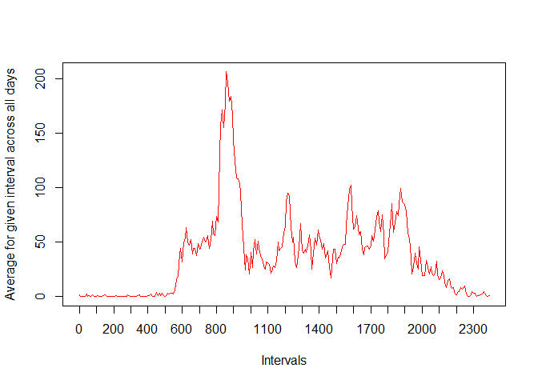

**Reading the data from activity data frame and show some summary statistics**

``` r
activitydata <- read.csv("C:/Users/niharika sarada/Desktop/coursera/activity.csv")
```

**1.calculating mean total number of steps taken per day**

``` r
library(dplyr)
```

    ## 
    ## Attaching package: 'dplyr'

    ## The following objects are masked from 'package:stats':
    ## 
    ##     filter, lag

    ## The following objects are masked from 'package:base':
    ## 
    ##     intersect, setdiff, setequal, union

``` r
total_day <- activitydata %>% group_by(date) %>%summarise(total_steps=sum(steps,na.rm=TRUE),na=mean(is.na(steps))) %>% print
```

    ## # A tibble: 61 x 3
    ##    date       total_steps    na
    ##    <fctr>           <int> <dbl>
    ##  1 2012-10-01           0  1.00
    ##  2 2012-10-02         126  0   
    ##  3 2012-10-03       11352  0   
    ##  4 2012-10-04       12116  0   
    ##  5 2012-10-05       13294  0   
    ##  6 2012-10-06       15420  0   
    ##  7 2012-10-07       11015  0   
    ##  8 2012-10-08           0  1.00
    ##  9 2012-10-09       12811  0   
    ## 10 2012-10-10        9900  0   
    ## # ... with 51 more rows

**2.Plotting histogram with the data**

``` r
total_day <- filter(total_day, na < 1)
hist(total_day$total_steps,col="yellow",breaks=20,main="Total steps per day",xlab="Steps per day")
abline(v=median(total_day$total_steps),lty=3, lwd=2, col="black")
legend(legend="median","topright",lty=3,lwd=2,bty = "n")
```

 **3.Calculating mean and median for the data**

``` r
mean_steps <- mean(total_day$total_steps,na.rm=TRUE)
median_steps <- median(total_day$total_steps,na.rm=TRUE)
```

**What is the average daily activity pattern?**

**1. Make a time series plot (i.e. type = "l") of the 5-minute interval (x-axis) and the average number of steps taken, averaged across all days (y-axis)**

``` r
library(dplyr)
daily_patterns <- activitydata %>% group_by(interval) %>% summarise(average=mean(steps,na.rm=TRUE))
plot(x = 1:nrow(daily_patterns),y = daily_patterns$average,type = "l",
     col = "red", xaxt = "n",xlab="Intervals", 
     ylab = "Average for given interval across all days")
axis(1,labels=daily_patterns$interval[seq(1,288,12)],
     at = seq_along(daily_patterns$interval)[seq(1,288,12)])
```



**2.Which 5-minute interval, on average across all the days in the dataset, contains the maximum number of steps?**

``` r
max_numb_steps_interval <- filter(daily_patterns,average==max(average))
```

**Imputing missing values**

**1. Calculate and report the total number of missing values in the dataset (i.e. the total number of rows with NAs)**

``` r
na_number <- sum(is.na(activitydata$steps))
na_number
```

    ## [1] 2304

``` r
percentage_na <- mean(is.na(activitydata$steps))
percentage_na
```

    ## [1] 0.1311475

**2. Devise a strategy for filling in all of the missing values in the dataset**

As the number of missing values in this dataset is fairly large, we cannot be sure if there is no bias introduced by missing values. Therefore we impute missing values based on average number of steps in particular 5-minutes interval.

**3. Create a new dataset that is equal to the original dataset but with the missing data filled in**

``` r
without_NAs <- numeric(nrow(activitydata))
for (i in 1:nrow(activitydata))
{
        if (is.na(activitydata[i,"steps"])==TRUE)
            {
                    without_NAs[i]<-filter(daily_patterns,interval==activitydata[i,"interval"]) %>% select(average)
            } 
        else
            {
                    without_NAs[i]<-activitydata[i,"steps"]
            }
                    
}
activity_without_NAs<-mutate(activitydata,steps_no_NAs=without_NAs)
head(activity_without_NAs)
```

    ##   steps       date interval steps_no_NAs
    ## 1    NA 2012-10-01        0     1.716981
    ## 2    NA 2012-10-01        5    0.3396226
    ## 3    NA 2012-10-01       10    0.1320755
    ## 4    NA 2012-10-01       15    0.1509434
    ## 5    NA 2012-10-01       20    0.0754717
    ## 6    NA 2012-10-01       25      2.09434

**4. Make a histogram of the total number of steps taken each day and Calculate and report the mean and median total number of steps taken per day**

``` r
total_day_noNAs <- activity_without_NAs %>% mutate(steps_no_NAs=as.numeric(steps_no_NAs)) %>% group_by(date) %>% summarise(total_steps=sum(steps_no_NAs))
hist(total_day_noNAs$total_steps,col="green",breaks=20,main="Total steps per day",xlab="Steps per day")
abline(v=median(total_day$total_steps),lty=3, lwd=2, col="black")
legend(legend="median","topright",lty=3,lwd=2,bty = "n")
```


**Are there differences in activity patterns between weekdays and weekends?**

**1. Create a new factor variable in the dataset with two levels - "weekday" and "weekend" indicating whether a given date is a weekday or weekend day**

``` r
library(lubridate)
```

    ## 
    ## Attaching package: 'lubridate'

    ## The following object is masked from 'package:base':
    ## 
    ##     date

``` r
is_weekday <-function(date){
        if(wday(date)%in%c(1,7)) result<-"weekend"
        else
                result<-"weekday"
        result
}

activity_without_NAs <- mutate(activity_without_NAs,date=ymd(date)) %>% mutate(day=sapply(date,is_weekday))

table(activity_without_NAs$day)
```

    ## 
    ## weekday weekend 
    ##   12960    4608

**2. Make a panel plot containing a time series plot (i.e. type = "l") of the 5-minute interval (x-axis) and the average number of steps taken, averaged across all weekday days or weekend days (y-axis)**

``` r
library(ggplot2)
daily_patterns <- activity_without_NAs %>% mutate(day=factor(day,levels=c("weekend","weekday")),steps_no_NAs=as.numeric(steps_no_NAs)) %>% group_by(interval,day) %>% summarise(average=mean(steps_no_NAs))
qplot(interval,average,data=daily_patterns,geom="line",facets=day~.)
```


